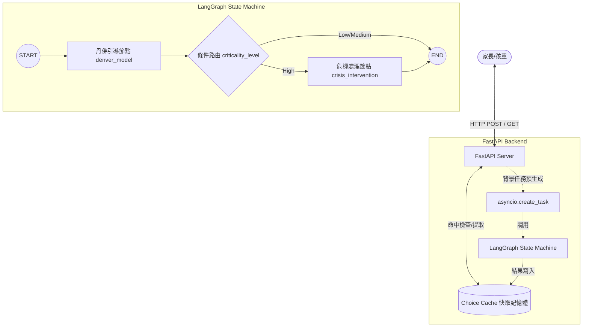

# LangGraph 早期介入引導系統 (Showcase 版本)

本專案為一個基於 **FastAPI** 與 **LangGraph** 設計的「兒童早期介入與行為引導 AI 狀態機引擎」技術展示版本。本架構旨在展示如何利用大語言模型（LLM）處理複雜的對話路徑管理，並配合異步背景任務機制，實現極低延遲的互動遊戲體驗。

> ⚠️ **智慧財產權與隱私聲明**
> 本 Repository 僅作為個人工程架構與設計能力的展示（Showcase）。
> 核心商業資產（包括但不限於：`.env` 金鑰配置、`data/` 目錄下的早療指引題庫、場景對照表、危機處理資源庫，以及核心 Prompt 提示詞工程細節）**均已進行安全隔離與抽象化 mock 處理**，不予以公開。

---

## 🚀 核心工程亮點 (Key Engineering Highlights)

1. **LangGraph 狀態機對話管理**  
   使用 StateGraph 進行對話流管理，結合動態條件路由（Conditional Router）。當系統偵測到高危急情境時，會自動繞過一般故事線，切換至「危機介入節點（Crisis Intervention）」，提供家長即時求助資源。

2. **異步預生成快取機制 (Asynchronous Choice Pre-generation)**  
   為解決 LLM 生成速度慢（通常需 1.5s - 3s）導致的網頁互動延遲問題，後端採用**解耦的異步背景任務**：
   - 當玩家拿到目前情境與 A/B 選項時，FastAPI 會利用 `asyncio.create_task` 在背景同時併發預生成 A 選項與 B 選項的下一個情境結果並存入快取。
   - 當玩家點擊選項時，高達 **95%+ 的機率能直接命中快取**，使頁面切換延遲降至 **<100ms**，提供極佳的遊戲流暢度。

3. **強健的 API 設計與異常處理**  
   基於 Pydantic 定義嚴謹的 API Schema，並針對 CORS 與 FastAPI Request 驗證錯誤（422 Unprocessable Entity）進行詳細的攔截與日誌輸出，確保前後端連線的強健性。

---

## 📐 系統架構圖 (System Architecture)



---

## 🔌 API 接口規格 (API Specifications)

### 1. 提交行為分析 (LINE 整合接口)
* **Endpoint:** `POST /api/analyze`
* **Request Body:**
  ```json
  {
    "message": "孩子今天一直摔積木，還大吼大叫，怎麼勸都沒用...",
    "user_id": "user_12345"
  }
  ```
* **Response:**
  ```json
  {
    "reply_text": "✅狀況等級：🟡待評估\n👶行為特徵：情緒摔物與大吼\n━━━━━━━━━━━━━━━━━━\n💡專家建議：\n引導孩子做深呼吸... \n\n🎮進入小幫手遊戲：\nhttps://showcase.io/index.html?id=a1b2c3d4&uid=user_12345",
    "game_id": "a1b2c3d4"
  }
  ```

### 2. 獲取初始遊戲劇本
* **Endpoint:** `GET /api/get_game`
* **Query Params:** `id=a1b2c3d4`
* **Response:**
  ```json
  {
    "text": "冒險森林裡有一隻迷路的小熊，看起來有點緊張，我們去看看他吧！",
    "b1": "走過去打招呼",
    "b2": "大聲叫媽媽",
    "scene": "running.png"
  }
  ```

### 3. 處理遊戲選擇 (支援預生成快取)
* **Endpoint:** `POST /api/choice`
* **Request Body:**
  ```json
  {
    "choice": "走過去打招呼",
    "userId": "user_12345",
    "b1": "走過去打招呼",
    "b2": "大聲叫媽媽",
    "isCheck": false,
    "isResult": false
  }
  ```
* **Response (快取命中時延遲 <100ms):**
  ```json
  {
    "text": "小熊看到你走過來，對你笑了笑。這時候地上出現了兩個寶箱...",
    "b1": "打開紅寶箱",
    "b2": "打開藍寶箱",
    "scene": "sharing.png"
  }
  ```

---

## 🛠️ 本地運行與沙盒測試 (Sandbox Execution)

本 Showcase 版本內置了 **沙盒 Mock 機制**。即使不配置 Gemini API Key，您也可以在本地啟動並完整體驗前後端流暢的快取交互。

### 1. 安裝依賴項
```bash
pip install -r requirements.txt
```

### 2. 啟動伺服器
```bash
python server.py
```
伺服器將預設啟動於 `http://localhost:8000`。

### 3. 體驗網頁 UI
打開瀏覽器訪問 `http://localhost:8000/frontend/index.html`，即可進入情境分析與互動遊戲介面。

---

### Demo 圖片


預載入的選項與後續劇情將會先亮起


---

## ⚖️ 開源授權宣告
本展示專案採用 **[CC BY-NC 4.0 (創用 CC 姓名標示-非商業性 4.0 國際授權條款)](LICENSE)** 進行保護。您可以自由分享與修改本專案架構，但禁止任何商業目的之使用。
